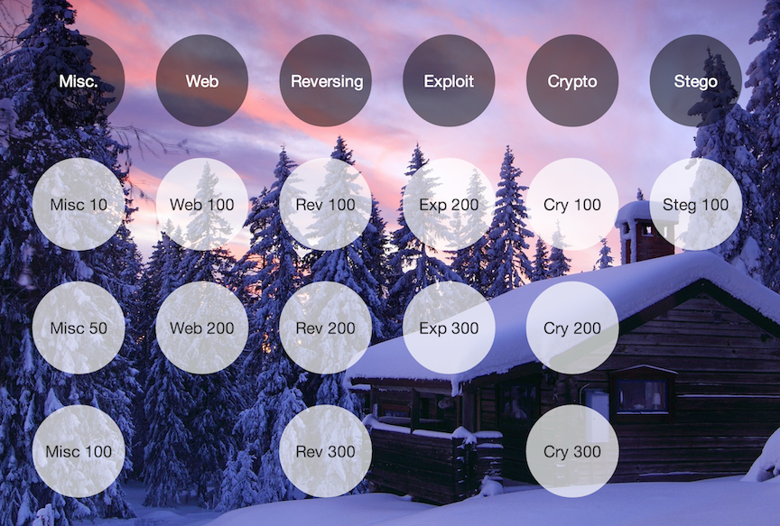

TinyCTF challenge writeups
==========================

Below are writeups for all of the TinyCTF challenges.

The TinyCTF server is available as a public AMI on Amazon EC2. The AMI
ID is: ami-cdca87fd.

Misc

* [Test flag, please ignore (10 points)](test/test.md "Test flag, please ignore (10 points)")
* [CAN HAS STDIO? (50 points)](stdio/stdio.md "CAN HAS STDIO? (50 points)")
* [János the Ripper (100 points)](janos/janos.md "János the Ripper (100 points)")

Web

* [NaNNaNNaNNaN…, Batman! (100 points)](batman/batman.md "NaNNaNNaNNaN…, Batman! (100 points)")
* [What is Loopy landscapes? (200 points)](loopy/loopy.md "What is Loopy landscapes? (200 points)")

Reversing

* [tt3441810 (100 points)](tt3441810/tt3441810.md "tt3441810 (100 points)")
* [Ooooooh! What does this button do? (200 points)](button/button.md "Ooooooh! What does this button do? (200 points)")
* [Elrond32 (300 points)](elrond32/elrond32.md "Elrond32 (300 points)")

Exploit

* [Not exactly Alcatraz (200 points)](alcatraz/alcatraz.md "Not exactly Alcatraz (200 points)")
* [Valet! (300 points)](valet/valet.md "Valet! (300 points)")

Crypto

* [Safer than rot13 (100 points)](rot13/rot13.md "Safer than rot13 (100 points)")
* [WTC RSA BBQ (200 points)](rsa/rsa.md "WTC RSA BBQ (200 points)")
* [ECB, it’s easy as 123 (300 points)](ecb/ecb.md "ECB, it’s easy as 123 (300 points)")

Stego

* [Erik, Baleog and Olaf (100 points)](erik/erik.md "Erik, Baleog and Olaf (100 points)")
