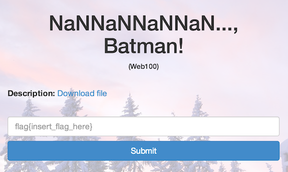
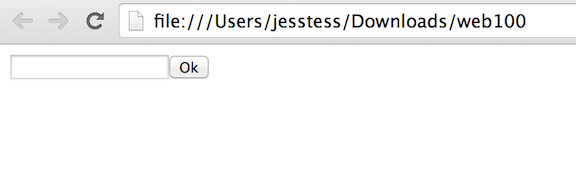
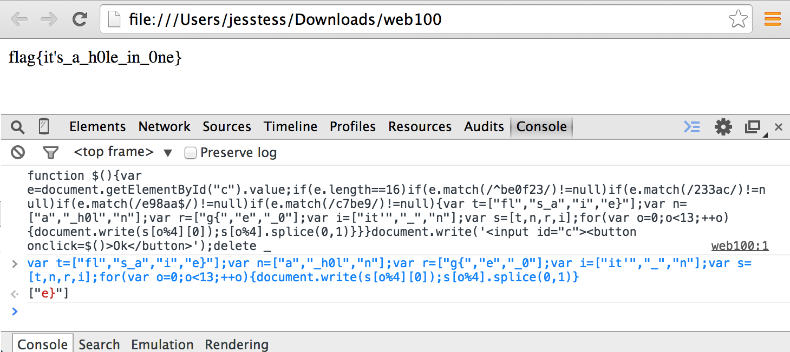

NaNNaNNaNNaN..., Batman!
========================

* Flag: **it's_a_h0le_in_0ne**
* File: [web100.zip](data/web100.zip "web100.zip")



Unzipping the archive produces a file, `web100`, containing HTML. If we open the file in a text editor, we see a bunch of obfuscating characters:

```
<script>_='function $(){^Be=^DgetEle^OById("c").value;^Nlength==16^E^be0f23^A233ac^Ae98aa$^Ac7be9^G){^Bt^Hfl^Cs_a^Ci^Ce}^Fn^Ha^C_h0l^Cn^Fr^Hg{^Ce^C_0^Fi^Hit\'^C_^Cn^Fs=[t,n,r,i];for(^Bo=0;o<13;++o){  ^K[0]);^K.splice(0,1)}}}        \'<input id="c"><^L onclick=$()>Ok</^L>\');delete _^A^G^E^Bvar ^C","^Ddocu^O.^E)^Nmatch(/^F"];^B^G/)!=null^H=[" ^Dwrite(^Ks[o%4]^Lbutton^Nif(e.^Oment';for(Y in $='^O^N^L^K     ^H^G^F^E^D^C^B^A')with(_.split($[Y]))_=join(pop());eval(_)</script>
```

If we open the file in a browser, we see a text box and button:



If we change the `eval(_)` at the end of the JavaScript to `console.log(_)`,
re-load the page, and examine the console output, we see the de-obfuscated
source:

```
function $(){var e=document.getElementById("c").value;if(e.length==16)if(e.match(/^be0f23/)!=null)if(e.match(/233ac/)!=null)if(e.match(/e98aa$/)!=null)if(e.match(/c7be9/)!=null){var t=["fl","s_a","i","e}"];var n=["a","_h0l","n"];var r=["g{","e","_0"];var i=["it'","_","n"];var s=[t,n,r,i];for(var o=0;o<13;++o){document.write(s[o%4][0]);s[o%4].splice(0,1)}}}document.write('<input id="c"><button onclick=$()>Ok</button>');
```

We could clean up the formatting and reason through the code, but pasting and
executing the relevant logic from the function at the console prints the flag:

```
var t=["fl","s_a","i","e}"];var n=["a","_h0l","n"];var r=["g{","e","_0"];var i=["it'","_","n"];var s=[t,n,r,i];for(var o=0;o<13;++o){document.write(s[o%4][0]);s[o%4].splice(0,1)}
```



The flag is: **it's_a_h0le_in_0ne**

[« Return to challenge board](../README.md "Return to challenge board")
