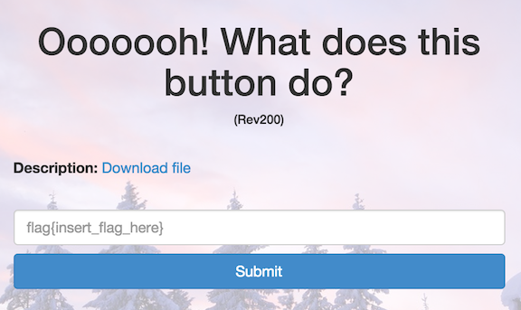
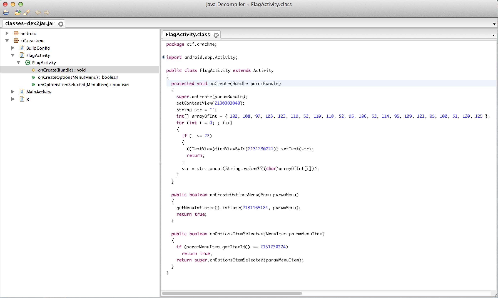

Ooooooh! What does this button do?
==================================

* Flag: **w4nn4_j4r_my_d3x**
* File: [rev200.zip](data/rev200.zip "rev200.zip")



Unzipping the challenge file produces another zip file. That file
unzips into the contents of an Android APK:

```
$ file rev200
rev200: Zip archive data, at least v2.0 to extract
$ unzip rev200
Archive:  rev200
  inflating: res/layout/activity_flag.xml
  inflating: res/layout/activity_main.xml
  inflating: res/menu/flag.xml
  inflating: res/menu/main.xml
  inflating: AndroidManifest.xml
  inflating: resources.arsc
  inflating: res/drawable-hdpi/ic_launcher.png
  inflating: res/drawable-mdpi/ic_launcher.png
  inflating: res/drawable-xhdpi/ic_launcher.png
  inflating: res/drawable-xxhdpi/ic_launcher.png
  inflating: classes.dex
  inflating: META-INF/MANIFEST.MF
  inflating: META-INF/CERT.SF
  inflating: META-INF/CERT.RSA
$ file classes.dex
classes.dex: Dalvik dex file version 035
```

We can use a tool like [dex2jar](https://code.google.com/p/dex2jar/)
to convert `classes.dex` to a jar file:

```
$ dex2jar-0.0.9.15/d2j-dex2jar.sh classes.dex
dex2jar classes.dex -> classes-dex2jar.jar
```

Which we can then open in a Java decompiler like [JD-GUI](http://jd.benow.ca/):



Inside the `ctf.crackme` package, in the `onCreate` method of the
`FlagActivity` class, we find some code to join an array of integers
into the flag string. We can run that logic manually to extract the
flag:

```
>>> data = "102, 108, 97, 103, 123, 119, 52, 110, 110, 52, 95, 106, 52, 114, 95, 109, 121, 95, 100, 51, 120, 125"
>>> "".join([chr(int(elt)) for elt in data.split(",")])
'flag{w4nn4_j4r_my_d3x}'
```

[« Return to challenge board](../README.md "Return to challenge board")
