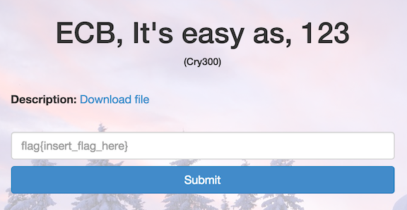
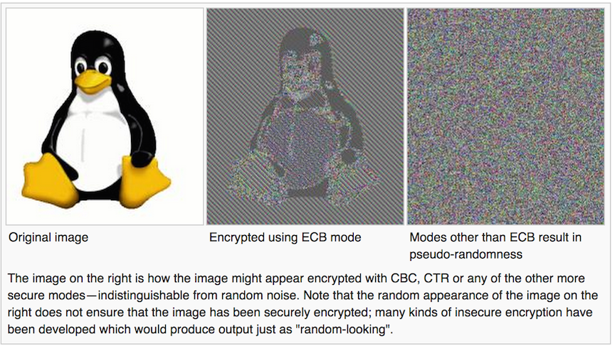
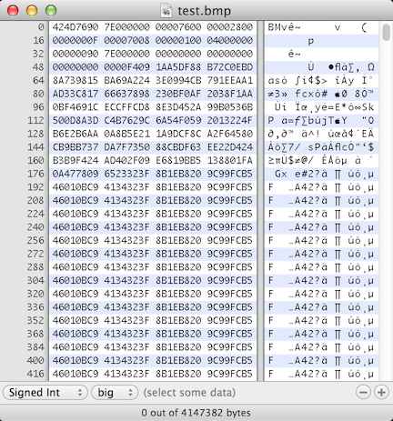

ECB, It’s easy as, 123
======================

* Flag: **no_penguin_here**
* File: [cry300.zip](data/cry300.zip "cry300.zip")



Unzipping the challenge file produces 2 files: `ecb.bmp` and
`task.txt`. The task file says:

> Somebody leaked a still from the upcoming Happy Feet Three movie,
> which will be released in 4K, but Warner Bros. was smart enough
> to encrypt it. But those idiots used a black and white bmp format,
> and that wasn't their biggest mistake. Show 'em who's boss and
> get the flag.

Trying to open the BMP file directly fails, presumably because it is
encrypted in some way:

```
$ file ecb.bmp
ecb.bmp: data
```

If we look at the hex at the beginning of the file, we see that we
don't have a BMP header. Instead we have the hex for the string
"Salted__", which after an internet search suggests that the data has
been encrypted using OpenSSL. The [OpenSSL
docs](https://www.openssl.org/docs/apps/enc.html) indicate that the 8
bytes after "Salted__" are the salt (`ab 31 b5 e5 ca 3d b9 4d`):

```
$ hexdump -C ecb.bmp | head -10
00000000  53 61 6c 74 65 64 5f 5f  ab 31 b5 e5 ca 3d b9 4d  |Salted__.1...=.M|
00000010  f4 09 1a a5 df 88 b7 2c  0e bd 8a 73 98 15 ba 69  |.......,...s...i|
00000020  a2 24 3e 09 94 cb 79 1e  ea a1 ad 33 c8 17 66 63  |.$>...y....3..fc|
00000030  78 98 23 0b f0 af 20 38  f1 aa 0b f4 69 1c ec cf  |x.#... 8....i...|
00000040  fc d8 8e 3d 45 2a 99 b0  53 6b 50 0d 8a 3d c4 b7  |...=E*..SkP..=..|
00000050  62 9c 6a 54 f0 59 20 13  22 4f b6 e2 b6 aa 0a 8b  |b.jT.Y ."O......|
00000060  5e 21 1a 9d cf 8c a2 f6  45 80 cb 9b b7 37 da 7f  |^!......E....7..|
00000070  73 50 88 cb df 63 ee 22  d4 24 b3 b9 f4 24 ad 40  |sP...c.".$...$.@|
00000080  2f 09 e6 81 9b b5 13 88  01 fa 0a 47 78 09 65 23  |/..........Gx.e#|
00000090  32 3f 8b 1e b8 20 9c 99  fc b5 46 01 0b c9 41 34  |2?... ....F...A4|
```

The rest of the file is the encrypted data. Given the title of
the challenge, it has probably been encrypted using ECB. The
[Wikipedia entry on ECB](http://en.wikipedia.org/wiki/Block_cipher_mode_of_operation#Electronic_codebook_.28ECB.29)
has a famous bitmap image of Tux the Linux penguin, encrypted using
ECB, to illustrate the fact that identical plaintext blocks are
encrypted into identical ciphertext blocks. For plaintext with large
repeating blocks of data, patterns in the plaintext are often still
discernible in the ciphertext:



If we can turn this encrypted data into a valid BMP, thanks to the
properties of ECB we should be able to recover interesting patterns
(like a flag!) from the unencrypted BMP.

If we review the
[Wikipedia page on the BMP file format](http://en.wikipedia.org/wiki/BMP_file_format)
it looks like if we can replace the OpenSSL string + 8-byte salt with
a valid BMP header, that should be sufficient to open the file.

We'll need to determine:

* The width and height of the bitmap
* The number of bits per pixel

We should be able to copy everything else from the example headers on
the Wikipedia page.

The task file hints that the image has
[4k resolution](http://en.wikipedia.org/wiki/4K_resolution), so the
dimensions are going to be either 3840 x 2160 or 4096 x 2160. We can just try
both.

According to the BMP spec, the number of bits per pixel can be 1, 2,
4, 8, 16, 24, or 32. We can just try each of these as well.

We can use our favorite hex editor to delete the first 16 bytes of
`ecb.bmp` ("OpenSSL__" + the 8 byte salt) and add the BMP header:



After trying a couple of combinations, we find one that works:

Hex           | Value             | Description
------------- | ----------------- | -----------
`42 4D`       | "BM"              | Magic number (unsigned integer 66, 77)
`76 90 7e 00` | 8294518 bytes (118+8294400) | Size of the BMP file (8294400 = 3840x2160)
`00 00`       | Unused            | Application specific
`00 00`       | Unused            | Application specific
`76 00 00 00` | 118 bytes (78+40) | Offset where the pixel array (bitmap data) can be found
`28 00 00 00` | 40 bytes          | Number of bytes in the DIB header (from this point)
`00 0f 00 00` | 3840              | Width of the bitmap in pixels
`70 08 00 00` | 2160              | Height of the bitmap in pixels
`01 00`       | 1 plane           | Number of color planes being used
`04 00`	      | 4 bits		  | Number of bits per pixel
`00 00 00 00` | 0                 | BI_RGB, no pixel array compression used
`00 90 7e 00` | 8294400 bytes     | Size of the raw bitmap data (including padding)
`00 00 00 00` | 0 pixels/meter horizontal | Print resolution of the image,
`00 00 00 00` | 0 pixels/meter vertical | (don't care about printing)
`00 00 00 00` | 0 colors          | Number of colors in the palette
`00 00 00 00` | 0 important colors| 0 means all colors are important

It's a 3840 x 2160 image with 4 bits per pixel:

```
$ file test.bmp
test.bmp: PC bitmap, Windows 3.x format, 3840 x 2160 x 4
```

It yields [this image](data/test.bmp "test.bmp"):


The image reveals an artifact from the unencrypted BMP:
`flag{no_penguin_here}`.

[« Return to challenge board](../README.md "Return to challenge board")
