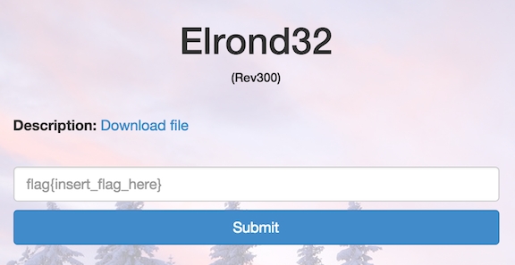

Elrond32
========

* Flag: **s0me7hing_S0me7hinG_t0lki3n**
* File: [rev300.zip](data/rev300.zip "rev300.zip")



Unzipping the challenge file produces a 32-bit ELF executable. It
looks like we'll need to provide a password to be given the flag:

```
$ file rev300
rev300: ELF 32-bit LSB  executable, Intel 80386, version 1 (SYSV), dynamically linked (uses shared libs), for GNU/Linux 2.6.24, BuildID[sha1]=a93ffe39302e19ef5184a1d86b720b11a7a97941, stripped
$ ./rev300 12345678
Access denied
```

The password isn't immediately obvious using tools like `strings`, so
it looks like we'll need to examine the assembly.

Skimming the structure of the program, we see a chunk of assembly (a
jump table, generated from a switch statement) where we are comparing
hex values to data on the stack:

```
 8048414:       55                      push   %ebp
 8048415:       89 e5                   mov    %esp,%ebp
 8048417:       83 ec 18                sub    $0x18,%esp
 804841a:       83 7d 0c 09             cmpl   $0x9,0xc(%ebp)
 804841e:       0f 87 b1 00 00 00       ja     80484d5 <putchar@plt+0x185>
 8048424:       8b 45 0c                mov    0xc(%ebp),%eax
 8048427:       c1 e0 02                shl    $0x2,%eax
 804842a:       05 20 87 04 08          add    $0x8048720,%eax
 804842f:       8b 00                   mov    (%eax),%eax
 8048431:       ff e0                   jmp    *%eax
 8048433:       8b 45 08                mov    0x8(%ebp),%eax
 8048436:       0f b6 00                movzbl (%eax),%eax
 8048439:       3c 6e                   cmp    $0x6e,%al
 804843b:       0f 84 9b 00 00 00       je     80484dc <putchar@plt+0x18c>
 8048441:       b8 00 00 00 00          mov    $0x0,%eax
 8048446:       e9 eb 00 00 00          jmp    8048536 <putchar@plt+0x1e6>
 804844b:       8b 45 08                mov    0x8(%ebp),%eax
 804844e:       0f b6 00                movzbl (%eax),%eax
 8048451:       3c 72                   cmp    $0x72,%al
 8048453:       0f 84 86 00 00 00       je     80484df <putchar@plt+0x18f>
 8048459:       b8 00 00 00 00          mov    $0x0,%eax
 804845e:       e9 d3 00 00 00          jmp    8048536 <putchar@plt+0x1e6>
 8048463:       8b 45 08                mov    0x8(%ebp),%eax
 8048466:       0f b6 00                movzbl (%eax),%eax
 8048469:       3c 64                   cmp    $0x64,%al
 804846b:       74 75                   je     80484e2 <putchar@plt+0x192>
 804846d:       b8 00 00 00 00          mov    $0x0,%eax
 8048472:       e9 bf 00 00 00          jmp    8048536 <putchar@plt+0x1e6>
 8048477:       8b 45 08                mov    0x8(%ebp),%eax
 804847a:       0f b6 00                movzbl (%eax),%eax
 804847d:       3c 65                   cmp    $0x65,%al
 804847f:       74 64                   je     80484e5 <putchar@plt+0x195>
 8048481:       b8 00 00 00 00          mov    $0x0,%eax
 8048486:       e9 ab 00 00 00          jmp    8048536 <putchar@plt+0x1e6>
 804848b:       8b 45 08                mov    0x8(%ebp),%eax
 804848e:       0f b6 00                movzbl (%eax),%eax
 8048491:       3c 69                   cmp    $0x69,%al
 8048493:       74 53                   je     80484e8 <putchar@plt+0x198>
 8048495:       b8 00 00 00 00          mov    $0x0,%eax
 804849a:       e9 97 00 00 00          jmp    8048536 <putchar@plt+0x1e6>
 804849f:       8b 45 08                mov    0x8(%ebp),%eax
 80484a2:       0f b6 00                movzbl (%eax),%eax
 80484a5:       3c 61                   cmp    $0x61,%al
 80484a7:       74 42                   je     80484eb <putchar@plt+0x19b>
 80484a9:       b8 00 00 00 00          mov    $0x0,%eax
 80484ae:       e9 83 00 00 00          jmp    8048536 <putchar@plt+0x1e6>
 80484b3:       8b 45 08                mov    0x8(%ebp),%eax
 80484b6:       0f b6 00                movzbl (%eax),%eax
 80484b9:       3c 67                   cmp    $0x67,%al
 80484bb:       74 31                   je     80484ee <putchar@plt+0x19e>
 80484bd:       b8 00 00 00 00          mov    $0x0,%eax
 80484c2:       eb 72                   jmp    8048536 <putchar@plt+0x1e6>
 80484c4:       8b 45 08                mov    0x8(%ebp),%eax
 80484c7:       0f b6 00                movzbl (%eax),%eax
 80484ca:       3c 73                   cmp    $0x73,%al
 80484cc:       74 23                   je     80484f1 <putchar@plt+0x1a1>
 80484ce:       b8 00 00 00 00          mov    $0x0,%eax
 80484d3:       eb 61                   jmp    8048536 <putchar@plt+0x1e6>
 80484d5:       b8 01 00 00 00          mov    $0x1,%eax
```

Those values are, in the order they show up in the assembly:

`6e 72 64 65 69 61 67 73`

These are all hex values in range for ASCII letters, which further
suggests that these are the letters that make up the password:

```
>>> "6e72646569616773".decode("hex")
'nrdeiags'
```

"nrdeiags" is not itself the password, though:

```
$ ./rev300 nrdeiags
Access denied
```

We'll need to figure out the order in which these hex values are
compared.

Let's examine the program under gdb, with a dummy password ("12345678")
for starters, and break at the top of the block of hex comparisons, at
`0x8048414`:

```
$ gdb rev300
GNU gdb (Ubuntu 7.7-0ubuntu3.1) 7.7
Copyright (C) 2014 Free Software Foundation, Inc.
License GPLv3+: GNU GPL version 3 or later <http://gnu.org/licenses/gpl.html>
This is free software: you are free to change and redistribute it.
There is NO WARRANTY, to the extent permitted by law.  Type "show copying"
and "show warranty" for details.
This GDB was configured as "x86_64-linux-gnu".
Type "show configuration" for configuration details.
For bug reporting instructions, please see:
<http://www.gnu.org/software/gdb/bugs/>.
Find the GDB manual and other documentation resources online at:
<http://www.gnu.org/software/gdb/documentation/>.
For help, type "help".
Type "apropos word" to search for commands related to "word"...
Reading symbols from rev300...(no debugging symbols found)...done.
(gdb) break *0x8048414
Breakpoint 1 at 0x8048414
(gdb) run 12345678
Starting program: /tmp/rev300 12345678

Breakpoint 1, 0x08048414 in ?? ()
```

We don't have debug symbols, so we'll need to step by
instruction. Beginning our walk through:

```
(gdb) display/i $pc
1: x/i $pc
=> 0x8048414:        push   %ebp
(gdb) stepi
0x08048415 in ?? ()
1: x/i $pc
=> 0x8048415:        mov    %esp,%ebp
(gdb) stepi
0x08048417 in ?? ()
1: x/i $pc
=> 0x8048417:        sub    $0x18,%esp
(gdb) stepi
0x0804841a in ?? ()
1: x/i $pc
=> 0x804841a:        cmpl   $0x9,0xc(%ebp)
```

At this point, the value at `%ebp + 0xc` is `0`, which is less than
`9`, so we have not yet reached a terminating condition. Stepping on:

```
(gdb) x $ebp + 0xc
0xffffd644:        0x00
(gdb) stepi
0x0804841e in ?? ()
1: x/i $pc
=> 0x804841e:        ja     0x80484d5
(gdb) stepi
0x08048424 in ?? ()
1: x/i $pc
=> 0x8048424:        mov    0xc(%ebp),%eax
(gdb) stepi
0x08048427 in ?? ()
1: x/i $pc
=> 0x8048427:        shl    $0x2,%eax
```

`%eax` currently holds `0`. We add `0x8048720`, move the address at
that location into `%eax`, and jump to it (`0x0804848b`):

```
(gdb) info reg eax
eax            0x0        0
(gdb) stepi
0x0804842a in ?? ()
1: x/i $pc
=> 0x804842a:        add    $0x8048720,%eax
(gdb) stepi
0x0804842f in ?? ()
1: x/i $pc
=> 0x804842f:        mov    (%eax),%eax
(gdb) x/4 0x8048720
0x8048720:        0x8b        0x84        0x04        0x08
(gdb) stepi
0x08048431 in ?? ()
1: x/i $pc
=> 0x8048431:        jmp    *%eax
(gdb) info reg eax
eax            0x804848b        134513803
(gdb) stepi
0x0804848b in ?? ()
1: x/i $pc
```

That is an address inside our block of hex comparisons! The value we
are going to compare against the first character in our password is
`0x69`, or "i":

```
 804848b:       8b 45 08                mov    0x8(%ebp),%eax
 804848e:       0f b6 00                movzbl (%eax),%eax
 8048491:       3c 69                   cmp    $0x69,%al
 8048493:       74 53                   je     80484e8 <putchar@plt+0x198>
```

We now know that "i" is the first letter of the password. Let's
restart the program, use test password "i2345678", break at the first
hex comparison with "0x69", (`0x8048491`), and from there walk to the
next hex comparison:

```
(gdb) break *0x8048491
Breakpoint 2 at 0x8048491
(gdb) run i2345678
Starting program: /tmp/rev300 i2345678

Breakpoint 2, 0x08048491 in ?? ()
1: x/i $pc
=> 0x8048491:        cmp    $0x69,%al
(gdb) stepi
0x08048493 in ?? ()
1: x/i $pc
=> 0x8048493:        je     0x80484e8
(gdb) stepi
0x080484e8 in ?? ()
1: x/i $pc
=> 0x80484e8:        nop
(gdb) stepi
0x080484e9 in ?? ()
1: x/i $pc
=> 0x80484e9:        jmp    0x80484f2
```

We jump to a chunk of assembly (`0x80484f2`) where a bunch of math is
done on `%ebp + 0xc` to determine the next offset in the jump table to
pursue:

```
 80484f2:       8b 45 0c                mov    0xc(%ebp),%eax
 80484f5:       8d 50 01                lea    0x1(%eax),%edx
 80484f8:       89 d0                   mov    %edx,%eax
 80484fa:       c1 e0 03                shl    $0x3,%eax
 80484fd:       89 c1                   mov    %eax,%ecx
 80484ff:       29 d1                   sub    %edx,%ecx
 8048501:       ba e9 a2 8b 2e          mov    $0x2e8ba2e9,%edx
 8048506:       89 c8                   mov    %ecx,%eax
 8048508:       f7 ea                   imul   %edx
 804850a:       d1 fa                   sar    %edx
 804850c:       89 c8                   mov    %ecx,%eax
 804850e:       c1 f8 1f                sar    $0x1f,%eax
 8048511:       29 c2                   sub    %eax,%edx
 8048513:       89 d0                   mov    %edx,%eax
 8048515:       c1 e0 02                shl    $0x2,%eax
 8048518:       01 d0                   add    %edx,%eax
 804851a:       01 c0                   add    %eax,%eax
 804851c:       01 d0                   add    %edx,%eax
 804851e:       89 ca                   mov    %ecx,%edx
 8048520:       29 c2                   sub    %eax,%edx
 8048522:       8b 45 08                mov    0x8(%ebp),%eax
 8048525:       83 c0 01                add    $0x1,%eax
 8048528:       89 54 24 04             mov    %edx,0x4(%esp)
 804852c:       89 04 24                mov    %eax,(%esp)
 804852f:       e8 e0 fe ff ff          call   8048414 <putchar@plt+0xc4>
```

This iteration, `$ebp + 0xc = 0x7`, which through the above
transformation puts `0x80484c4` in `%eax`:

```
 => 0x8048431:        jmp    *%eax
(gdb) info reg eax
eax            0x80484c4        134513860
```

We jump to `0x80484c4`, which is the hex comparison for `0x73`, or
"s". We know the password starts with "is".

Continue tracing through the 8 hex comparisons to complete the
password: "isengard", one of the fortresses of Gondor in the Lord of
the Rings (hence the challenge title). That password reveals the flag:

```
$ ./rev300 isengard
Access granted
flag{s0me7hing_S0me7hinG_t0lki3n}
```

[« Return to challenge board](../README.md "Return to challenge board")
