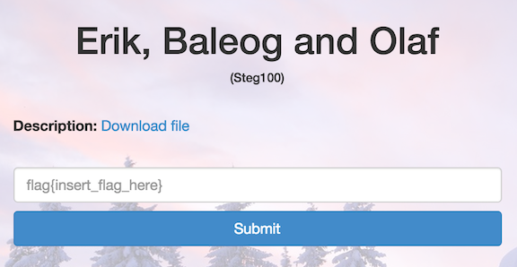
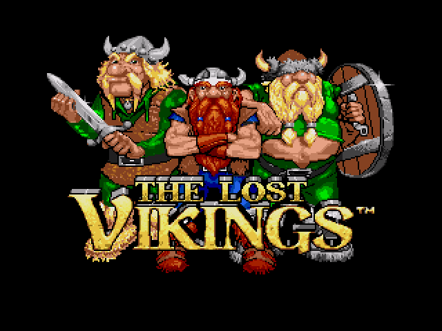
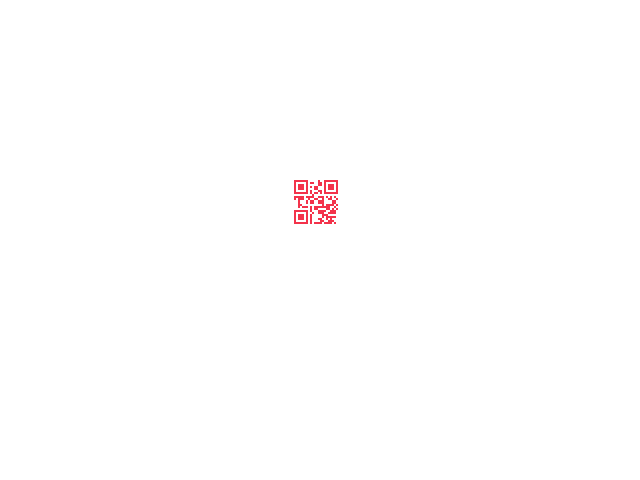

Erik, Baleog and Olaf
=====================

* Flag: **#justdiffit**
* File: [stego100.zip](data/stego100.zip "stego100.zip")



Unzipping the challenge file produces a PNG:



We can check the image metadata with `identify -verbose stego100`. The
full output is [here](data/identify.txt "identify output"), but the
main point of interest is the hint in the Properties section:

```
...
  Properties:
    date:create: 2014-11-01T17:46:21-04:00
    date:modify: 2014-11-01T17:46:21-04:00
    hint: http://i.imgur.com/22kUrzm.png
    png:cHRM                 : chunk was found (see Chromaticity, above)
    png:gAMA                 : gamma=0.45454544 (See Gamma, above)
...
```

`http://i.imgur.com/22kUrzm.png` is the seemingly identical:


If we diff the images with `compare stego100 22kUrzm.png -compose src
diff.png`, we get a QR code:



Scanning the code produces a note:

`flag{#justdiffit}`

[« Return to challenge board](../README.md "Return to challenge board")
