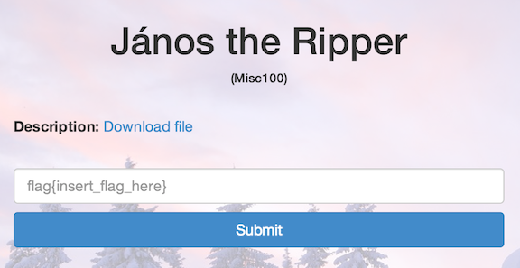

János the Ripper
================

* Flag: **ev3n::y0u::bru7us?!**
* File: [misc100.zip](data/misc100.zip "misc100.zip")

Unzipping the archive produces a file, `misc100`:

    $ file misc100
    misc100: Zip archive data, at least v2.0 to extract

If we attempt to unzip the file, we are prompted for a password:

    $ unzip misc100
    Archive:  misc100
    [misc100] flag.txt password:
       skipping: flag.txt                incorrect password

The title of the challenge suggests that we should use [John the
Ripper](http://www.openwall.com/john/) to crack the password. After downloading
the software, running `zip2john` against our password-protected ZIP file
quickly produces a hash:

    $ ./john-1.7.9-jumbo-7-Linux-x86-64/run/zip2john misc100 > hash_file
    misc100->flag.txt PKZIP Encr: cmplen=39, decmplen=25, crc=7788D444
    $ ./john-1.7.9-jumbo-7-Linux-x86-64/run/john hash_file --show
    misc100:fish

    1 password hash cracked, 0 left

Using the password `fish`, we can unzip the file and read the flag from
`flag.txt`:

    $ unzip misc100
    Archive:  misc100
    [misc100] flag.txt password:
      inflating: flag.txt
    $ cat flag.txt
    flag{ev3n::y0u::bru7us?!}

[« Return to challenge board](../README.md "Return to challenge board")
