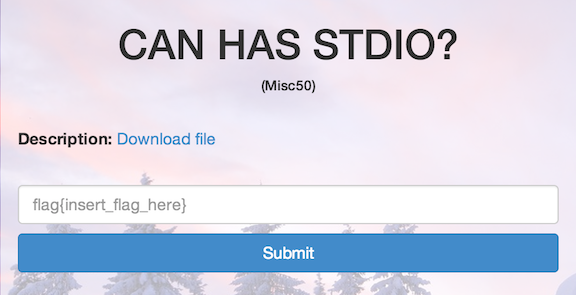

CAN HAS STDIO?
==============

* Flag: **esolangs_for_fun_and_profit**
* File: [misc50.zip](data/misc50.zip "misc50.zip")



Unzipping the archive produces a file, `misc50`, containing the following:


```
                                      +
                                     ++
                                     +++
                                    ++[>
                                    +>++>
                                   +++>++
                                   ++>++++
                                  +>++++++
                                  >+++++++>
                                 ++++++++>+
                                 ++++++++>++
                                ++++++++>+++
                                ++++++++>++++
          ++++++++>+++++++++++++>++++++++++++++>+++++++++++++++>++
            ++++++++++++++<<<<<<<<<<<<<<<<-]>>>>>>>>>>>>>--.++<<
              <<<<<<<<<<<>>>>>>>>>>>>>>----.++++<<<<<<<<<<<<<<
                >>>>>>>>>>>>+.-<<<<<<<<<<<<>>>>>>>>>>>>>-.+<
                  <<<<<<<<<<<<>>>>>>>>>>>>>>>+++.---<<<<<<
                    <<<<<<<<<>>>>>>>>>>>>>---.+++<<<<<<<
                      <<<<<<>>>>>>>>>>>>>>+++.---<<<<<
                        <<<<<<<<<>>>>>>>>>>>>>>-.+<<
                          <<<<<<<<<<<<>>>>>>>>>>>>
                          >>----.++++<<<<<<<<<<<<<
                          <>>>>>>>>>>>>+.-<<<<<<<<
                         <<<<>>>>>>>>>>>>>>--.++<<<
                         <<<<<<<<<<<>>>>>>>>>>>>>-.
                        +<<<<<<<<<<<<<>>>>>>>>>>>>>>
                        +++.---<<<<<<   <<<<<<<<>>>>
                       >>>>>>>>-.+<       <<<<<<<<<<<
                       >>>>>>>>>>           >>>--.++<
                      <<<<<<<<<               <<<>>>>>
                      >>>>>>                    >>>-.+
                     <<<<<                        <<<<<
                     <<<                            <>>
                    >>                                >>


>>>>>>>>++.--<<<<<<<<<<<<<<>>>>>>>>>>>>-.+<<<<<<<<<<<<>>>>>>>>>>>>>--.++<<<<<<<<<<<<<>>>>>>>>>>>>>>>---.+++<<<<<<<<<<<<<<<>>>>>>>>>>>>>>--.++<<<<<<<<<<<<<<>>>>>>>>>>>>-.+<<<<<<<<<<<<>>>>>>>>>>>>+.-<<<<<<<<<<<<>>>>>>>>>>>>>>--.++<<<<<<<<<<<<<<>>>>>>>>>>>>>----.++++<<<<<<<<<<<<<>>>>>>>>>>>>-.+<<<<<<<<<<<<>>>>>>>>>>>>>>.<<<<<<<<<<<<<<>>>>>>>>>>>>>>++.--<<<<<<<<<<<<<<>>>>>>>>>>>>>>-.+<<<<<<<<<<<<<<>>>>>>>>>>>>>--.++<<<<<<<<<<<<<>>>>>>>>>>>>>+.-<<<<<<<<<<<<<>>>>>>>>>>>>>>>----.++++<<<<<<<<<<<<<<<>>>>>>>>>>>>>>>>---.+++<<<<<<<<<<<<<<<<.
```

This is a Brainfuck program. Executing the program locally or through
an [online
interpreter](http://esoteric.sange.fi/brainfuck/impl/interp/i.html)
prints:

    flag{esolangs_for_fun_and_profit}

[« Return to challenge board](../README.md "Return to challenge board")
