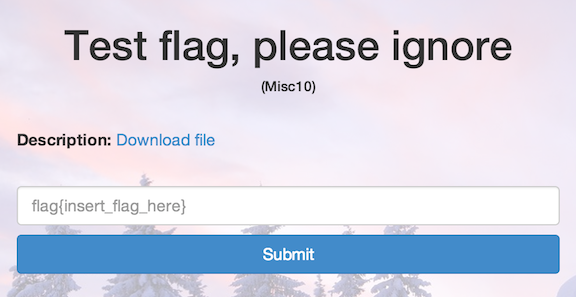

Test flag, please ignore
========================

* Flag: **hello_world**
* File: [misc10.zip](data/misc10.zip "misc10.zip")

Unzipping the archive produces a file, `misc10`, containing the following:

    666c61677b68656c6c6f5f776f726c647d

Decoding the hex reveals the flag:

    $ python -c 'print "666c61677b68656c6c6f5f776f726c647d".decode("hex")'
    flag{hello_world}

[« Return to challenge board](../README.md "Return to challenge board")
