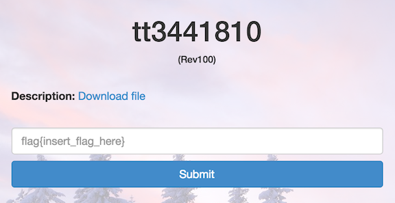

tt3441810
=========

* Flag: **poppopret**
* File: [rev100.zip](data/rev100.zip "rev100.zip")



The challenge file contains some hex:

```
>>> data = """68 66 6C 00 00 48 BF 01  00 00 00 00 00 00 00 48
... 8D 34 24 48 BA 02 00 00  00 00 00 00 00 48 B8 01
... 00 00 00 00 00 00 00 0F  05 68 61 67 00 00 48 BF
... 01 00 00 00 00 00 00 00  48 8D 34 24 48 BA 02 00
... 00 00 00 00 00 00 48 B8  01 00 00 00 00 00 00 00
... 0F 05 68 7B 70 00 00 48  BF 01 00 00 00 00 00 00
... 00 48 8D 34 24 48 BA 02  00 00 00 00 00 00 00 48
... B8 01 00 00 00 00 00 00  00 0F 05 68 6F 70 00 00
... 48 BF 01 00 00 00 00 00  00 00 48 8D 34 24 48 BA
... 02 00 00 00 00 00 00 00  48 B8 01 00 00 00 00 00
... 00 00 0F 05 68 70 6F 00  00 48 BF 01 00 00 00 00
... 00 00 00 48 8D 34 24 48  BA 02 00 00 00 00 00 00
... 00 48 B8 01 00 00 00 00  00 00 00 0F 05 68 70 72
... 00 00 48 BF 01 00 00 00  00 00 00 00 48 8D 34 24
... 48 BA 02 00 00 00 00 00  00 00 48 B8 01 00 00 00
... 00 00 00 00 0F 05 68 65  74 00 00 48 BF 01 00 00
... 00 00 00 00 00 48 8D 34  24 48 BA 02 00 00 00 00
... 00 00 00 48 B8 01 00 00  00 00 00 00 00 0F 05 68
... 7D 0A 00 00 48 BF 01 00  00 00 00 00 00 00 48 8D
... 34 24 48 BA 02 00 00 00  00 00 00 00 48 B8 01 00
... 00 00 00 00 00 00 0F 05  48 31 FF 48 B8 3C 00 00
... 00 00 00 00 00 0F 05"""
```

If we decode the hex, we see some repeated garbage characters (a lot
of `[hH$?4]`) interspersed with the format of a flag:

```
>>> print "".join(data.split()).decode("hex")
hflH?H?4$H?H?hagH?H?4$H?H?h{pH?H?4$H?H?hopH?H?4$H?H?hpoH?H?4$H?H?hprH?H?4$H?H?hetH?H?4$H?H?h}
H?H?4$H?H?H1?H?<
```

We could manually extract the flag by staring at it and ignoring the garbage characters:

<pre>
h<b>fl</b>H?H?4$H?H?h<b>ag</b>H?H?4$H?H?h<b>{p</b>H?H?4$H?H?h<b>op</b>H?H?4$H?H?h<b>po</b>H?H?4$H?H?h<b>pr</b>H?H?4$H?H?h<b>et</b>H?H?4$H?H?h<b>}</b>
H?H?4$H?H?H1?H?&lt;
</pre>

Use a regular expression to ignore the garbage characters:

```
>>> print re.sub(r'[hH4$?]', '', re.sub(r'[^\x01-\x7F]', '', "".join(data.split()).decode("hex")))
flag{poppopret}
1<
```

Notice that there seem to be 2 flag characters after every `h` and
pull out the flag that way:

```
>>> "".join(elt[:2] for elt in "".join(data.split()).decode("hex").split("h"))
'flag{poppopret}\n'
```

Or do an internet search for the challenge title, "tt3441810", and see
that it is the IMDB entry for the movie Some Assembly Required:


If we use an x86-64 disassembler to disassemble the hex, we can see
that this is part of a program that `write`s the flag. The many `h`s
in the decoded hex are from the repeated `push` instructions, and the
many `H`s are from the repeated `lea`s and `movabs`s:

```
.data:0x00000000	68666c0000	push   0x6c66
.data:0x00000005	48bf0100000000000000	movabs rdi,0x1
.data:0x0000000f	488d3424	lea    rsi,[rsp]
.data:0x00000013	48ba0200000000000000	movabs rdx,0x2
.data:0x0000001d	48b80100000000000000	movabs rax,0x1
.data:0x00000027	0f05	syscall
.data:0x00000029	6861670000	push   0x6761
.data:0x0000002e	48bf0100000000000000	movabs rdi,0x1
.data:0x00000038	488d3424	lea    rsi,[rsp]
.data:0x0000003c	48ba0200000000000000	movabs rdx,0x2
.data:0x00000046	48b80100000000000000	movabs rax,0x1
.data:0x00000050	0f05	syscall
.data:0x00000052	687b700000	push   0x707b
.data:0x00000057	48bf0100000000000000	movabs rdi,0x1
.data:0x00000061	488d3424	lea    rsi,[rsp]
.data:0x00000065	48ba0200000000000000	movabs rdx,0x2
.data:0x0000006f	48b80100000000000000	movabs rax,0x1
.data:0x00000079	0f05	syscall
.data:0x0000007b	686f700000	push   0x706f
.data:0x00000080	48bf0100000000000000	movabs rdi,0x1
.data:0x0000008a	488d3424	lea    rsi,[rsp]
.data:0x0000008e	48ba0200000000000000	movabs rdx,0x2
.data:0x00000098	48b80100000000000000	movabs rax,0x1
.data:0x000000a2	0f05	syscall
.data:0x000000a4	68706f0000	push   0x6f70
.data:0x000000a9	48bf0100000000000000	movabs rdi,0x1
.data:0x000000b3	488d3424	lea    rsi,[rsp]
.data:0x000000b7	48ba0200000000000000	movabs rdx,0x2
.data:0x000000c1	48b80100000000000000	movabs rax,0x1
.data:0x000000cb	0f05	syscall
.data:0x000000cd	6870720000	push   0x7270
.data:0x000000d2	48bf0100000000000000	movabs rdi,0x1
.data:0x000000dc	488d3424	lea    rsi,[rsp]
.data:0x000000e0	48ba0200000000000000	movabs rdx,0x2
.data:0x000000ea	48b80100000000000000	movabs rax,0x1
.data:0x000000f4	0f05	syscall
.data:0x000000f6	6865740000	push   0x7465
.data:0x000000fb	48bf0100000000000000	movabs rdi,0x1
.data:0x00000105	488d3424	lea    rsi,[rsp]
.data:0x00000109	48ba0200000000000000	movabs rdx,0x2
.data:0x00000113	48b80100000000000000	movabs rax,0x1
.data:0x0000011d	0f05	syscall
.data:0x0000011f	687d0a0000	push   0xa7d
.data:0x00000124	48bf0100000000000000	movabs rdi,0x1
.data:0x0000012e	488d3424	lea    rsi,[rsp]
.data:0x00000132	48ba0200000000000000	movabs rdx,0x2
.data:0x0000013c	48b80100000000000000	movabs rax,0x1
.data:0x00000146	0f05	syscall
.data:0x00000148	4831ff	xor    rdi,rdi
.data:0x0000014b	48b83c00000000000000	movabs rax,0x3c
.data:0x00000155	0f05	syscall
```

[« Return to challenge board](../README.md "Return to challenge board")
